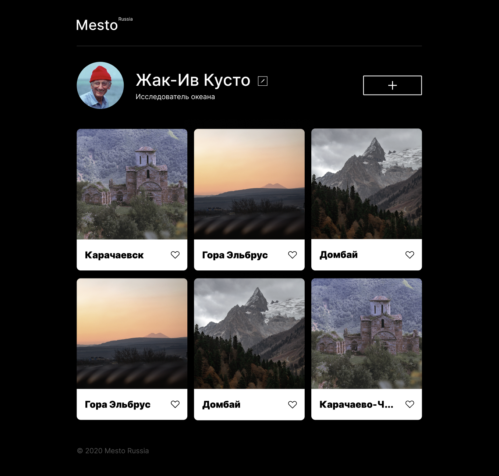

# Проект MESTO

### Описание:
  Проект разрабатывался в рамках моего обучения на Веб-разработчика в Яндекс.Практикум.
Он создавался поэтапно, от простого к сложному. Изначально состоял только из CSS и HTML, после чего добавился JavaScript и проект был подключен к серверу.
  Mesto - это компактная интеррактивная страница, где можно размещать информацию о себе, загружать фотографии, лайкать их и удалять. Также, этот функционал доступен для любого стороннего пользователя.

  ### Функционал:
* Редактирование аватара и профиля пользователя;
* Добавление фото и лайков под ними;
* Удаление фото и лайков;
* Открытие фото в полном размере;
* LiveValidation форм.

### **Какие технологии использовались**
* HTML
*  CSS:
    - Flex layout;
    - Grid layout;
    - Позиционирование элементов;
    - Адаптация сайта с использованием @media запросов;
* JavaScript:
    - ООП (классы, наследование);
    - Директивы Export и Import в JS;
    - Работа с сервером (ассинхронность, fetch, Promise, API);
* Webpack;
* Методология БЭМ;
* Файловая структура БЭМ Nested.
* Верстка Pixel Perfect;

### **Установка и запуск проекта**

1. Склонируйте репозиторий на свой компьютер:
`git@github.com:Ksenia-Beznos/mesto.git`
2. Установите зависимости:
`npm install`
3. Соберите проект:
`npm run build`
4. Запустите проект:
`npm run dev`

### **Макеты этапов проекта**
[1 этап](https://www.figma.com/file/2cn9N9jSkmxD84oJik7xL7/JavaScript.-Sprint-4?type=design&node-id=0-1&mode=design)
[2 этап](https://www.figma.com/file/bjyvbKKJN2naO0ucURl2Z0/JavaScript.-Sprint-5?type=design&node-id=0-1&mode=design)
[3 этап](https://www.figma.com/file/kRVLKwYG3d1HGLvh7JFWRT/JavaScript.-Sprint-6?type=design&node-id=0-1&mode=design)
[4 этап](https://www.figma.com/file/PSdQFRHoxXJFs2FH8IXViF/JavaScript.-Sprint-9?type=design&node-id=0-1&mode=design)

**Автор сайта**: Ксения Безнос.